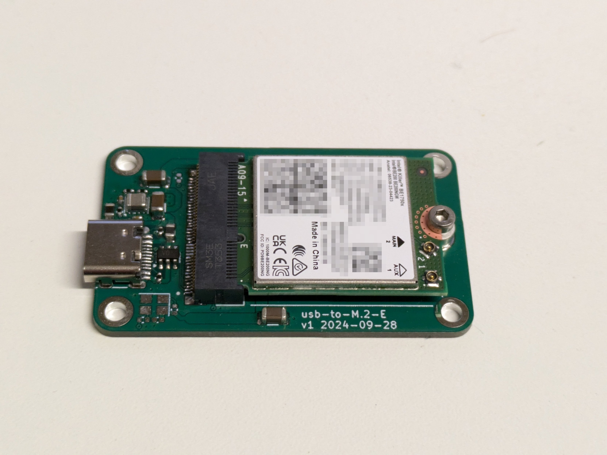

# USB ⇔ M.2-E

## Why?

I wanted an USB Bluetooth dongle with support for recent Bluetooth versions (and LE Isochronous Channels in particular, while still supporting Bluetooth Classic) with Linux support that isn't excessively painful, which rules out basically every off-the-shelf dongle in existence.

Intel WiFi cards have excellent Bluetooth support, but they come in the form of M.2 cards which are meant to be installed internally. The aim of this project was to answer the question whether those cards would still work if only the Bluetooth component (which uses USB, unlike the WiFi part which attaches through PCIe) was active. The answer turned out to be yes (see [below](#compatibilty) for known-working cards).

## What is it?

It's a simple PCB that contains:

 * An USB-C receptacle
 * A 5V → 3.3V voltage regulator
 * A M.2 E-key socket
 * Optionally a SUSCLK oscillator

Only the USB section of the M.2 interface is connected.

## Fabrication

This is a basic 1.6mm 2 layer board that should be manufacturable almost anywhere. I used JLCPCB, you can find the Gerbers in the [`generated/fab`](generated/fab/) directory and a BOM in [`generated/bom.csv`](generated/bom.csv).

## Compatibility

This section lists cards that are known to work with this adapter:

 * Intel Killer BE1750x (Bluetooth uses the `AUX` antenna)

Note that most Intel WiFi cards also come in a CNVio variant that uses the same connector, but uses it in a non-standard fashion. It is unknown if those cards would work with this adapter.
